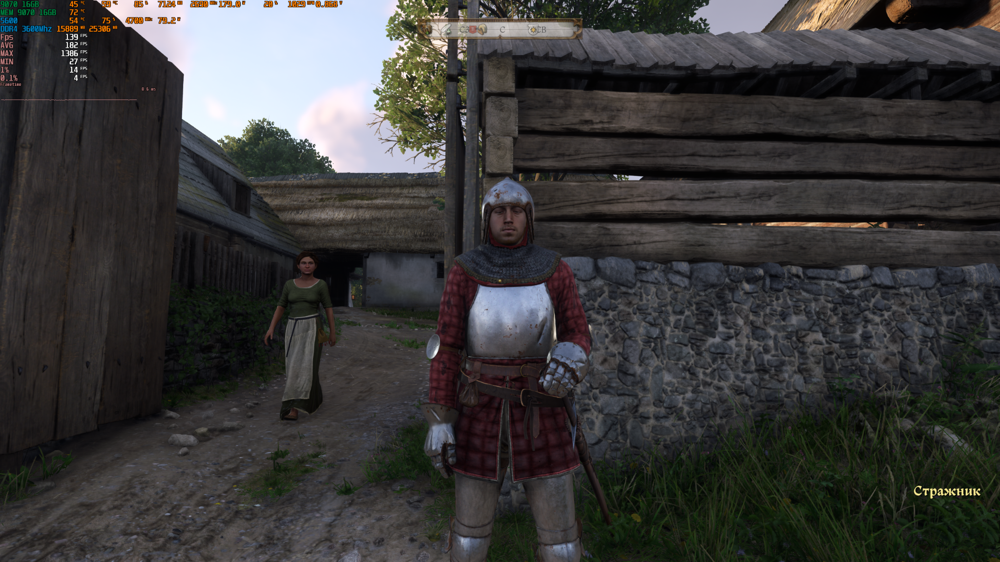
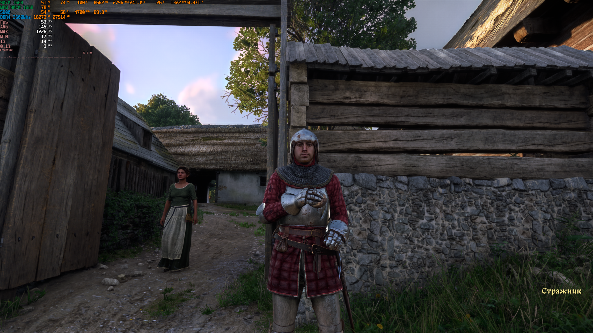

# Kingdom Come: Deliverance II — RX 9070 comparison

Experimental comparison captured on **27 Sep 2026** on an **AMD Radeon RX 9070 (non-XT)**.

## Test setup

- GPU: Radeon RX 9070
- Resolution: 2560x1440
- Game preset: Ultra
- Upscaling: FSR Quality
- Goal: compare the older standalone **DLSS-NR-on-AMD 0.4.1** path with several AMDNR / OptiScaler configurations.

This is **not an objective image-quality ranking**. Perception can change with the scene, display, motion, sharpening, exposure, screenshot compression and the viewer. The files here are published so other users can reproduce the experiment and judge the result for themselves.

## Standalone reference

`standalone/dlssnr_on_amd.ini` is the configuration from the working standalone 0.4.1 setup used as the visual reference.

Key values in that file include:

- `LocalStructure=1`
- `LocalTone=0`
- `Temporal=1`
- `PreUpscale=1`
- `UseDepth=1`
- `UseFsrInputs=1`

## OptiScaler experiment sequence

The `optiscaler/` folder contains snapshots made during the comparison:

1. `00_pretest_2026-09-27_2058.ini` — state before the focused comparison.
2. `01_lmxxf_900tier.ini` — lmxxf / 900-tier test.
3. `01_match_standalone_structure.ini` — attempt to move the OptiScaler result toward the standalone structure/detail character.
4. `02_daniel_backend_match_standalone.ini` — Daniel backend comparison.
5. `03_daniel_fullmodel_classic_finaltest.ini` — final OptiScaler test state from this session.

During this test, the standalone 0.4.1 result was subjectively preferred in some scenes for a more coherent/natural overall image and stronger surface structure, while some OptiScaler settings looked good in other areas. The lmxxf version in KCD2 was perceived as flatter in this particular comparison.

That is a **scene-specific subjective observation**, not a claim that one runtime is universally better.

## Screenshot pair

The pair below was captured in the same general test area.

| NR OFF | Standalone DLSS-NR-on-AMD 0.4.1 — NR ON |
|---|---|
|  |  |

Observed overlay values in these captures were approximately **139 FPS with NR off** and **53 FPS with standalone NR on**. These screenshots are not a controlled benchmark; they are included primarily for visual comparison.

## What is included / not included

Included:
- configuration files created or saved during the test;
- two comparison screenshots.

Not included:
- DLLs;
- runtime binaries;
- weight files;
- OptiScaler or AMDNR binaries.

Install the upstream projects separately and use these files only as experiment references.
